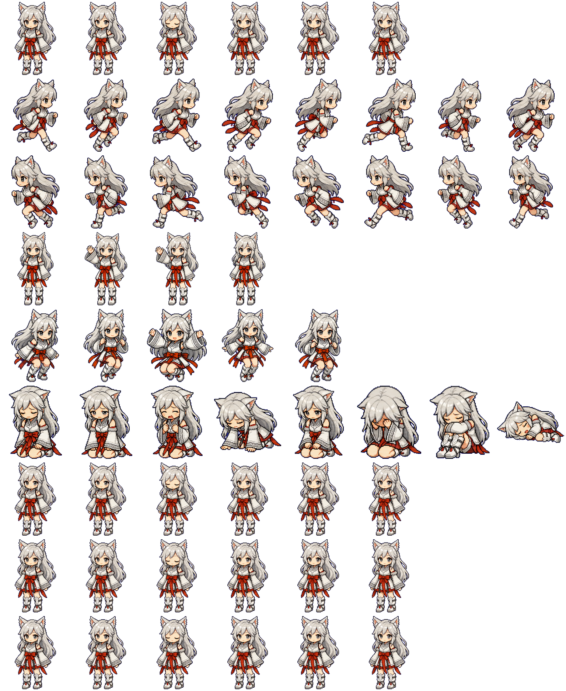

# 银月

银月是一个 Codex 自定义桌面宠物。它是一只银白长发、狐耳、白色巫女风服饰的小型 chibi 宠物，使用透明 WebP 精灵图集呈现待机、移动、挥手、跳跃、失败、等待、运行中和审阅等状态。



## 文件

| 文件 | 说明 |
| --- | --- |
| `pet.json` | 宠物元数据，包含宠物 ID、显示名称、简介和精灵图路径。 |
| `spritesheet.webp` | 透明背景动画图集，供 Codex 读取并播放。 |

`pet.json` 内容摘要：

```json
{
  "id": "yinyue",
  "displayName": "银月",
  "description": "A small silver-haired fox-eared desktop pet inspired by the supplied character sheet and pose sheet.",
  "spritesheetPath": "spritesheet.webp"
}
```

## 动画规格

- 图集尺寸：`1536 x 1872`
- 单帧尺寸：`192 x 208`
- 网格规格：`8` 列 x `9` 行
- 图片格式：`WebP`
- 背景：透明

| 行 | 状态 | 帧数 | 用途 |
| --- | --- | ---: | --- |
| 0 | `idle` | 6 | 待机呼吸和眨眼循环 |
| 1 | `running-right` | 8 | 向右移动 |
| 2 | `running-left` | 8 | 向左移动 |
| 3 | `waving` | 4 | 挥手问候 |
| 4 | `jumping` | 5 | 起跳、腾空、落下 |
| 5 | `failed` | 8 | 失败或沮丧反应 |
| 6 | `waiting` | 6 | 等待状态 |
| 7 | `running` | 6 | 执行任务中 |
| 8 | `review` | 6 | 审阅或专注检查 |

未使用的格子保持透明，方便 Codex 按固定网格读取。

## 安装

将仓库中的 `pet.json` 和 `spritesheet.webp` 放到 Codex 自定义宠物目录：

```text
%USERPROFILE%\.codex\pets\yinyue\
```

最终目录结构应为：

```text
yinyue/
  pet.json
  spritesheet.webp
```

然后重启或刷新 Codex，在支持自定义宠物的环境中选择“银月”即可使用。

## 维护说明

- 如果替换 `spritesheet.webp`，请保持 `1536 x 1872` 图集尺寸和 `192 x 208` 单帧尺寸不变。
- 如果修改文件名，请同步更新 `pet.json` 里的 `spritesheetPath`。
- 如果增加或减少动画帧，请确认未使用格子仍为透明，避免播放时出现残影或空白异常。
